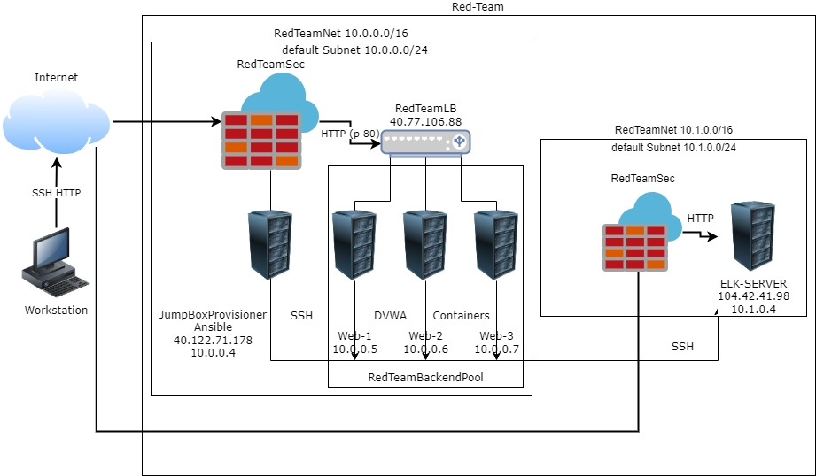

# First project
## Automated ELK Stack Deployment

The files in this repository were used to configure the network depicted below.

These files have been tested and used to generate a live ELK deployment on Azure. They can be used to either recreate the entire deployment pictured above. Alternatively, select portions of the playbook file may be used to install only certain pieces of it, such as Filebeat.

  - [my-playbook.yml](./Ansible/my-playbook.yml) - Used to install DVWA Servers.
  - [install-elk.yml](./Ansible/install-elk.yml) - Used to install Elk Server.
    - [filebeat-playbook.yml](./Ansible/filebeat-playbook.yml) - Used to install and configure Filebeat on ELK server and DVWA Server.
    - [metricbeat-playbook.yml](./Ansible/metricbeat-playbook.yml) - Used to install and configure Metricbeat on ELK server and DVWA Server.

This document contains the following details:
- Description of the Topologu
- Access Policies
- ELK Configuration
  - Beats in Use
  - Machines Being Monitored
- How to Use the Ansible Build

### Description of the Topology

The main purpose of this network is to expose a load-balanced and monitored instance of DVWA, the D*mn Vulnerable Web Application.

Load balancing ensures that the application will be highly available, in addition to restricting access to the network.
- Load balancers protect the servers from being overloaded by network traffic. It balances the traffic!
- The advantage of having a Jumpbox is to have one spot for administrative access so that the servers aren't accessed from the internet by everyone.

Integrating an ELK server allows users to easily monitor the vulnerable VMs for changes to the logs and system traffic.
- Filebeat watches for log files and collects events.
- Metricbeat records statistics from the OS and services running on the servers.

The configuration details of each machine may be found below.
_Note: Use the [Markdown Table Generator](http://www.tablesgenerator.com/markdown_tables) to add/remove values from the table_.

| Name       | Function    | IP Address | Operating System |
|------------|-------------|------------|------------------|
| Jump Box   | Gateway     | 10.0.0.4   | Linux            |
| Web-1      | DVWA Server | 10.0.0.5   | Linux            |
| Web-2      | DVWA Server | 10.0.0.6   | Linux            |
| Web-3      | DVWA Server | 10.0.0.7   | Linux            |
| ELK Server | ELK Stack   | 10.1.0.4   | Linux            |

### Access Policies

The machines on the internal network are not exposed to the public Internet. 

Only the Jumpbox machine can accept connections from the Internet. Access to this machine is only allowed from the following IP addresses:
- My personal IP address.

Machines within the network can only be accessed by SSH.
- The ELK Server is only accessed through SSH from the Jumpbox with my personal IP address.

A summary of the access policies in place can be found in the table below.

| Name          | Publicly Accessible | Allowed IP Addresses |
|---------------|---------------------|----------------------|
| Jump Box      | No                  | SSH MY IP            |
| Web-1         | Yes                 |40.77.106.88, 10.0.0.4|
| Web-2         | Yes                 |40.77.106.88, 10.0.0.4|
| Web-3         | Yes                 |40.77.106.88, 10.0.0.4|
| ELK Server    | No                  | SSH 10.1.0.4:5601    |

### Elk Configuration

Ansible was used to automate configuration of the ELK machine. No configuration was performed manually, which is advantageous because...
Automating configuration with Ansible can be sent to many machines at the same time. 
Also, not needing to write scripts on each machine reduces the chance for errors to occur.

The playbook implements the following tasks:
- Install Docker.io and pip3.
- Change VM Memory size.
- Download and Configure ELK docker container.
- Set ports.

The following screenshot displays the result of running `docker ps` after successfully configuring the ELK instance.

### Target Machines & Beats

This ELK server is configured to monitor the following machines:
- Web-1 10.0.0.5
- Web-2 10.0.0.6
- Web-3 10.0.0.7

I have installed the following Beats on these machines:
- Filebeat

These Beats allow us to collect the following information from each machine:
- Filebeats collect log files on its host, then transfers the logs to the ELK Server then you open and inspect with Kibana.

### Using the Playbook

In order to use the playbook, you will need to have an Ansible control node already configured. Assuming you have such a control node provisioned: 

SSH into the control node and follow the steps below:
- Copy the filebeat-config.yml file to /etc/ansible/files.
- Update the config file to include the private IP of the ELK Server to the Elasticsearch and Kibana sections of the config file.
- Run the playbook, and navigate to ELK servers IP:5601 to check that the installation worked as expected.

Which file is the playbook? Where do you copy it?
- `install-elk.yml`, copy to /etc/ansible.
Which file do you update to make Ansible run the playbook on a specific machine? How do I specify which machine to install the ELK server on versus which to install Filebeat on?
- `hosts` file is where you update the IP addresses of the machines you want installed.
Which URL do you navigate to in order to check that the ELK server is running?
- Navigate to http://publicIP(elkserver):5601
